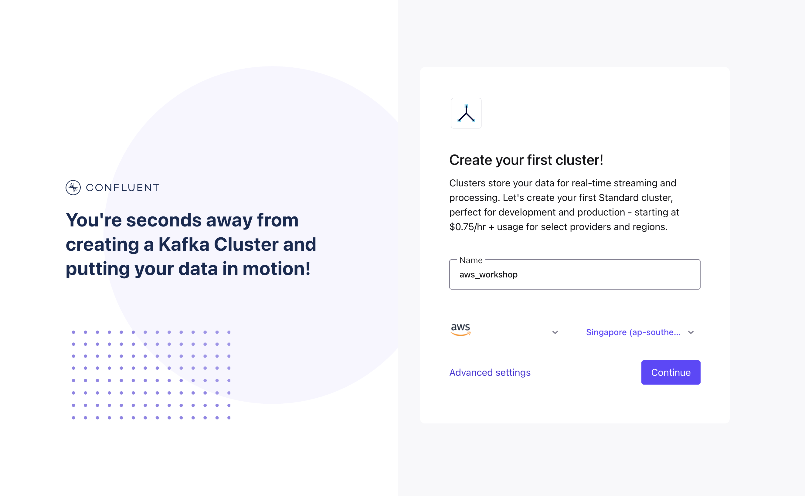
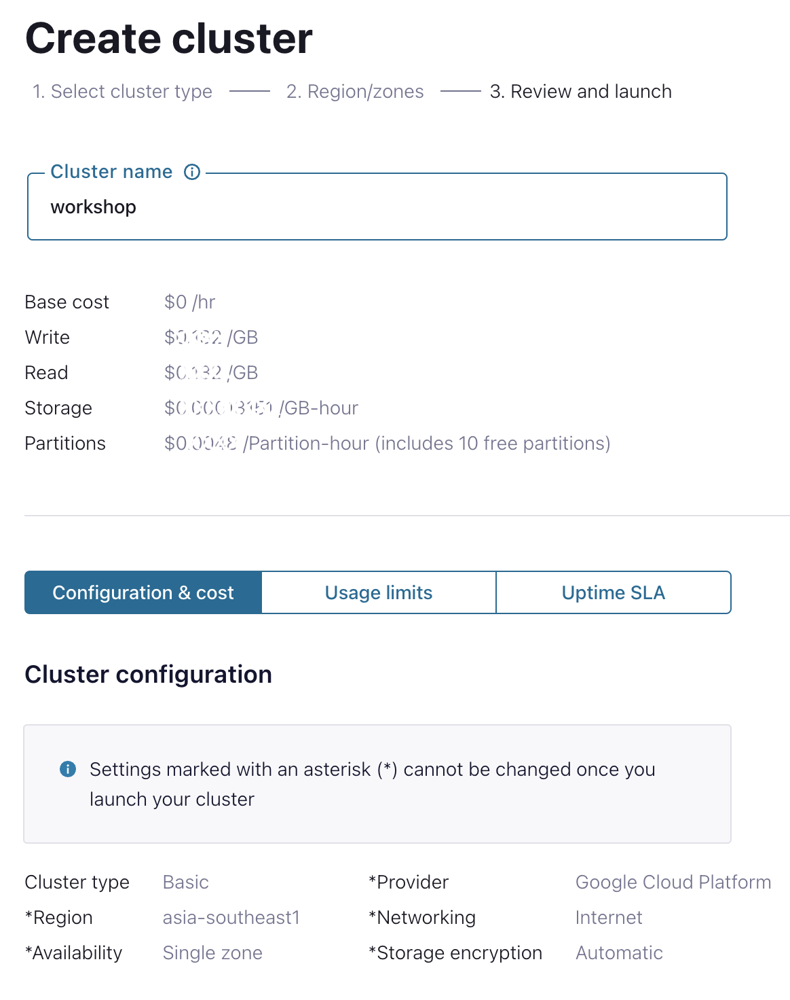
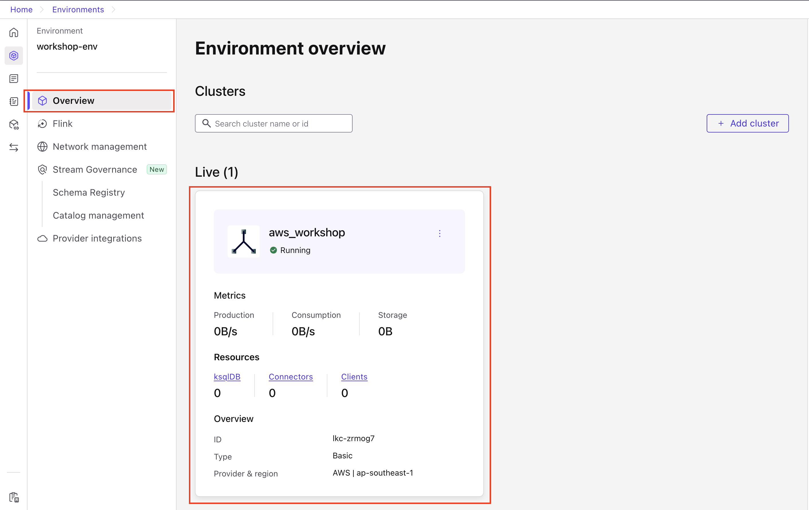
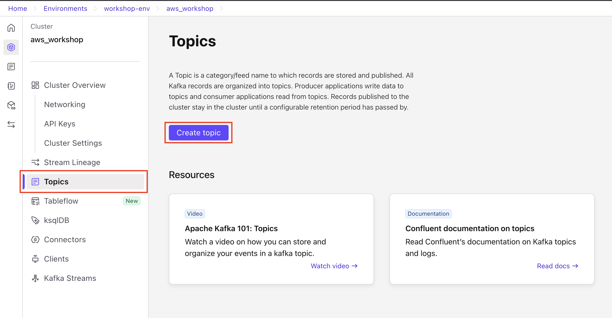
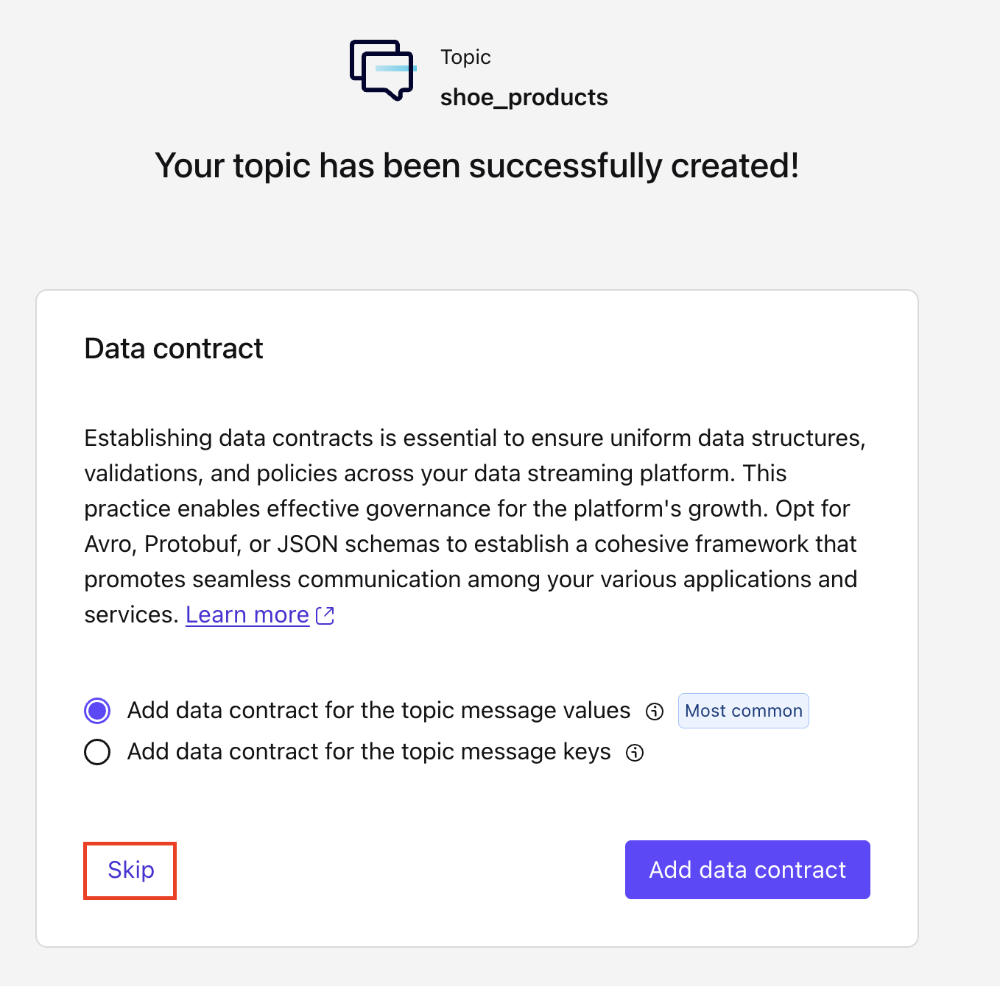
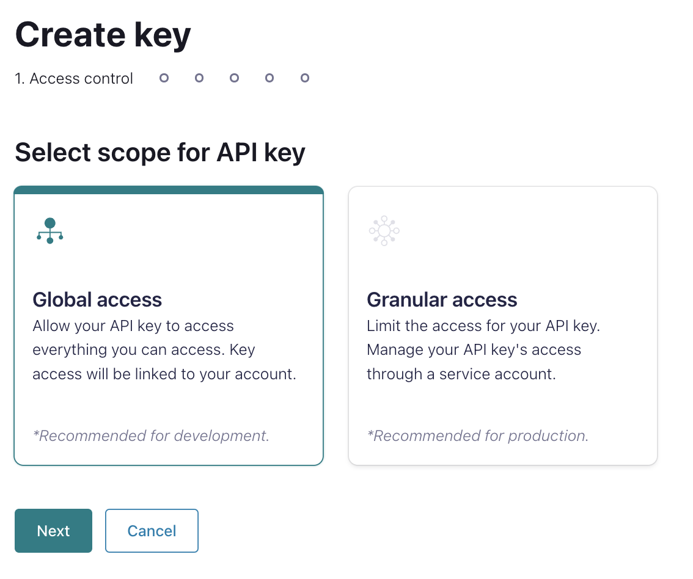

<div align="center" padding=25px>
    
</div>

# <div align="center">Confluent Schema Registry Workshop</div>
## <div align="center">Lab Guide</div>
<br>

## **Agenda**
1. [Log into Confluent Cloud](#step-1)
2. [Create an Environment and Cluster](#step-2)
3. [Create Topics and walk through Confluent Cloud Dashboard](#step-3)
4. [Create an API Key Pair](#step-4)
5. [Create Kafka Client to Produce and Consume using Schema Registry](#step-5)
6. [How Schema Registry handle mismatch format data](#step-6)
7. [How Kafka Client Dynamically evolve the data](#step-7)
8. [Clean Up Resources](#step-8)
9. [Confluent Resources and Further Testing](#step-9)

***

## **Prerequisites**
<br>

1. Create a Confluent Cloud Account.
    - Sign up for a Confluent Cloud account [here](https://www.confluent.io/confluent-cloud/tryfree/).
    - Once you have signed up and logged in, click on the menu icon at the upper right hand corner, click on “Billing & payment”, then enter payment details under “Payment details & contacts”. A screenshot of the billing UI is included below.

> _**Note:** You will create resources during this workshop that will incur costs. When you sign up for a Confluent Cloud account, you will get free credits to use in Confluent Cloud. This will cover the cost of resources created during the workshop. More details on the specifics can be found [here](https://www.confluent.io/confluent-cloud/tryfree/)._

<div align="center" padding=25px>
    
</div>

<div align="center" padding=25px>
    
</div>

<div align="center" padding=25px>
    
</div>

***

## **Objective**

<br>

Welcome to “Enable Real-Time Data Transformations and Stream Processing with Apache Flink on Confluent Cloud”! In this workshop, you will learn how to build stream processing applications using Apache Flink on Confluent Cloud as well as learn about the use cases Apache Flink unlocks: streaming ETL, data discovery and enrichment, anomaly detection, and more.

In this workshop, you will have learned how to leverage Apache Flink to perform continuous transformations, create materialized views, and serve lookups against these materialized views all with the data you already have in Confluent Cloud even connected with Bedrock to leverage your AI Implementation in real-time.

<div align="center" padding=25px>
    
</div>

***


## <a name="step-1"></a>Log into Confluent Cloud

1. Log into [Confluent Cloud](https://confluent.cloud) and enter your email and password.

<div align="center" padding=25px>
    
</div>

2. If you are logging in for the first time, you will see a self-guided wizard that walks you through spinning up a cluster. Please minimize this as you will walk through those steps in this workshop. 

***

## <a name="step-2"></a>Create an Environment and Cluster

An environment contains clusters and its deployed components such as Apache Flink, Connectors, ksqlDB, and Schema Registry. You have the ability to create different environments based on your company's requirements. For example, you can use environments to separate Development/Testing, Pre-Production, and Production clusters. 

1. Click **+ Add cloud environment**. Specify an **Environment Name** and choose the **Essential Package** for stream governance, then Click **Create**. 

>Stream Governance have two option **Essential** and **Advanced**, which in Advanced it will give you more rich features over the governance such as Stream Lineage up to 7 days, Data Catalog, Business Metadata, and unlimited Schema to be registered on Confluent Cloud.

>_**Note:** There is a *default* environment ready in your account upon account creation. You can use this *default* environment for the purpose of this workshop if you do not wish to create an additional environment._

<div align="center" padding=25px>
    
</div>

<div align="center" padding=25px>
    
</div>

2. Now that you have an environment, click **Create Cluster**. 

> **Note:** Confluent Cloud clusters are available in 3 types: Basic, Standard, and Dedicated. Basic is intended for development use cases so you will use that for the workshop. Basic clusters only support single zone availability. Standard and Dedicated clusters are intended for production use and support Multi-zone deployments. If you are interested in learning more about the different types of clusters and their associated features and limits, refer to this [documentation](https://docs.confluent.io/current/cloud/clusters/cluster-types.html).

3. Chose the **Basic** cluster type. 

<div align="center" padding=25px>
    
</div>

4. Click **Begin Configuration**. 
5. Choose **AWS** as your preferred Cloud Provide on **ap-southeast-1 (Singapore)** region, and **Single-AZ** availability zone. 
6. Specify a **Cluster Name**. For the purpose of this lab, any name will work here. 

<div align="center" padding=25px>
    
</div>

7. View the associated *Configuration & Cost*, *Usage Limits*, and *Uptime SLA* information before launching. 
8. Click **Launch Cluster**. 

***


## <a name="step-4"></a>Creates Topic and Walk Through Cloud Dashboard

1. On the navigation menu, you will see **Cluster Overview**. 

> **Note:** This section shows Cluster Metrics, such as Throughput and Storage. This page also shows the number of Topics, Partitions, Connectors, and ksqlDB Applications.  Below is an example of the metrics dashboard once you have data flowing through Confluent Cloud.

<div align="center" padding=25px>
    
</div>

<div align="center" padding=25px>
    
</div>

2. Click on **Cluster Settings**. This is where you can find your *Cluster ID, Bootstrap Server, Cloud Details, Cluster Type,* and *Capacity Limits*.
3. On the same navigation menu, select **Topics** and click **Create Topic**. 
4. Enter **go-test-topic** as the topic name, **3** as the number of partitions, and then click **Create with defaults**. Skip the data contracts as it will be created on the other step. 

<div align="center" padding=25px>
    
</div>

<div align="center" padding=25px>
    
</div>

<div align="center" padding=25px>
    
</div>

> _**Note:** Topics have many configurable parameters. A complete list of those configurations for Confluent Cloud can be found [here](https://docs.confluent.io/cloud/current/using/broker-config.html). If you are interested in viewing the default configurations, you can view them in the Topic Summary on the right side._ 

5. After topic creation, the **Topics UI** allows you to monitor production and consumption throughput metrics and the configuration parameters for your topics. When you begin sending messages to Confluent Cloud, you will be able to view those messages and message schemas.
6. Below is a look at the topic, **go-test-topic**, but you need to send data to this topic before you see any metrics.

<div align="center" padding=25px>
    
</div>

***

## <a name="step-5"></a>Create an API Key

1. Click **API Keys** on the navigation menu. 
2. Click **Create Key** in order to create your first API Key. If you have an existing API Key select **+ Add Key** to create another API Key.

<div align="center" padding=25px>
    
</div>

3. Select **Global Access** and then click **Next**. 
4. Copy or save your API Key and Secret somewhere. You will need these later on in the lab, you will not be able to view the secret again once you close this dialogue. 
5. After creating and saving the API key, you will see this API key in the Confluent Cloud UI in the **API Keys** section. If you don’t see the API key populate right away, refresh the browser.

***

## <a name="step-6"></a>Connect Flink with Bedrock Model
The next step is to create a integrated model from AWS Bedrock with Flink on Confluent Cloud.

1. First, you will create the model connection using Confluent CLI. If you've never installed one, you could install it based on your OS (https://docs.confluent.io/confluent-cli/current/install.html) and login to confluent.
```bash
confluent login
```

2. Make sure you prepare your AWS API Key and Secret to create connection to the Bedrock.

```bash
confluent flink connection create my-connection-sg --cloud aws --region ap-southeast-2 --type bedrock --endpoint https://bedrock-runtime.us-west-2.amazonaws.com/model/anthropic.claude-3-sonnet-20240229-v1:0/invoke --aws-access-key <API Key> --aws-secret-key <API Secret>
```

> **Note:** region input need to be the same region for your Flink environment, only the endpoint for bedrock could cross-region.

>Go to **AWS IAM>User** and create User
<div align="center">
    
</div>

>Create User with attach policies for Bedrock Full Access
<div align="center">
    
</div>

<div align="center">
    
</div>

>Create API Key by search your user that has been created and click on the "Create Access Key"
<div align="center">
    
</div>

<div align="center">
    
</div>

<div align="center">
    
</div>

3. After creating connection, go back to the Flink SQL Workspace to create the model in Flink before we could invoke on our query.
```sql
CREATE MODEL NotificationEngine
INPUT (loyal_level STRING)
OUTPUT (promotion STRING)
WITH (
  'task' = 'text_generation',
  'provider' = 'bedrock',
  'bedrock.PARAMS.max_tokens' = '20000',
  'bedrock.connection' = 'my-connection',
  'bedrock.system_prompt' = 'You are an expert in the shoes market. Your task is to create an email for notification to customer of their loyalty level. No preamble needed, only output the Subject and Email Body in different line. Mention Subject word and Email Body word at the beginning of each line. Subject and Email body must be separated by 2 line breaks consistently. Congratulate their status but also inform users about the next level: Climbing needs purchase greater than 7000 to reach Bronze, Bronze needs purchase greater than 70000 to reach Silver, Silver needs purchase greater than 700000 to reach Gold.'
);
```

<div align="center">
    
</div>

4. Alter the Table as stream/append mode.
```sql
ALTER TABLE shoe_loyalty_levels SET ('changelog.mode' = 'append');
```
> **Note:** The model will only work with table that using the stream or append mode.

5. Now let's invoke the model and get the results.

```sql
SELECT email, promotion FROM shoe_loyalty_levels, LATERAL TABLE(ML_PREDICT('NotificationEngine', loyalty_level));
```
<div align="center">
    
</div>

***

## <a name="step-16"></a>Clean Up Resources

Deleting the resources you created during this workshop will prevent you from incurring additional charges. 

1. Finally, under **Cluster Settings**, select the **Delete Cluster** button at the bottom. Enter the **Cluster Name** and select **Confirm**. 

<div align="center">
    
</div>

*** 

## <a name="step-17"></a>Confluent Resources and Further Testing

Here are some links to check out if you are interested in further testing:
- [Confluent Cloud Documentation](https://docs.confluent.io/cloud/current/overview.html)
- [Apache Flink 101](https://developer.confluent.io/courses/apache-flink/intro/)
- [Stream Processing with Confluent Cloud for Apache Flink](https://docs.confluent.io/cloud/current/flink/index.html)
- [Flink SQL Reference](https://docs.confluent.io/cloud/current/flink/reference/overview.html)
- [Flink SQL Functions](https://docs.confluent.io/cloud/current/flink/reference/functions/overview.html)

***
