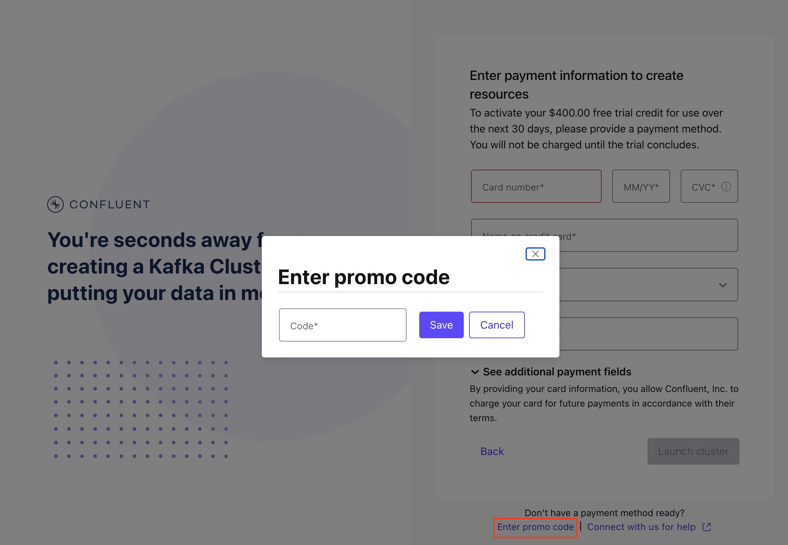
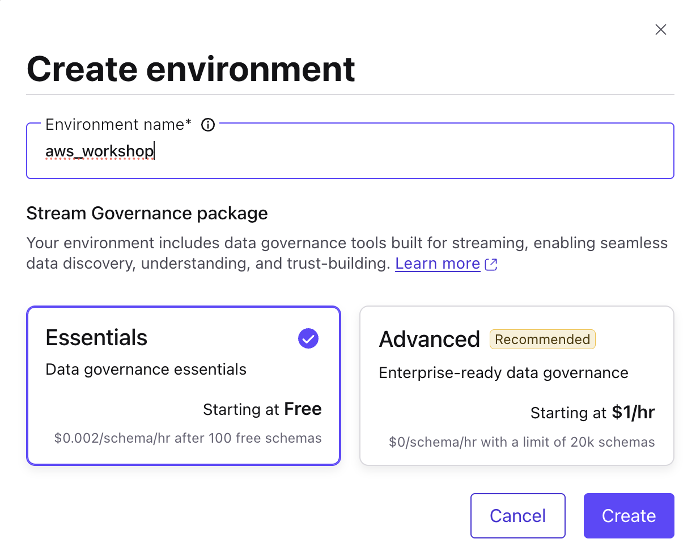
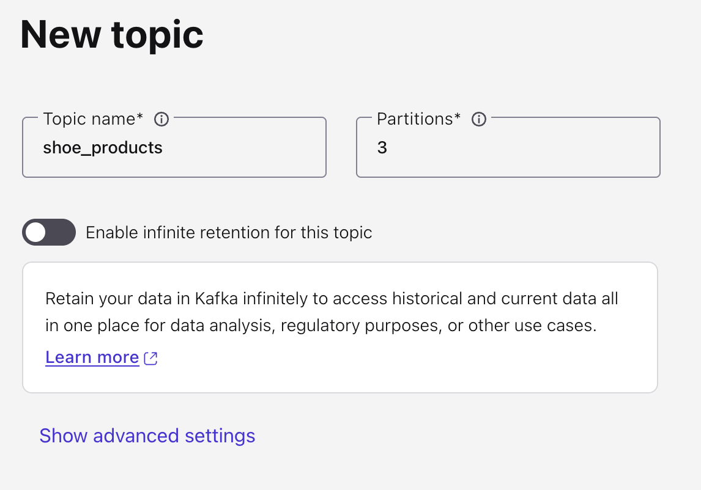
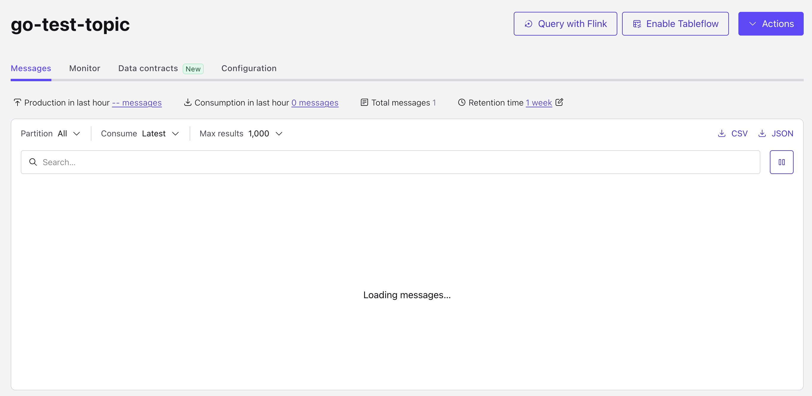

<div align="center" padding=25px>
    
</div>

# <div align="center">Confluent Schema Registry Workshop</div>
## <div align="center">Lab Guide</div>
<br>

## **Agenda**
1. [Log into Confluent Cloud](#step-1)
2. [Create an Environment and Cluster](#step-2)
3. [Create Topics and walk through Confluent Cloud Dashboard](#step-3)
4. [Create an API Key Pair](#step-4)
5. [Create Kafka Client to Produce and Consume using Schema Registry](#step-5)
6. [How Schema Registry handle mismatch format data](#step-6)
7. [How Kafka Client Dynamically evolve the data](#step-7)
8. [Clean Up Resources](#step-8)
9. [Confluent Resources and Further Testing](#step-9)

***

## **Prerequisites**
<br>

1. Create a Confluent Cloud Account.
    - Sign up for a Confluent Cloud account [here](https://www.confluent.io/confluent-cloud/tryfree/).
    - Once you have signed up and logged in, click on the menu icon at the upper right hand corner, click on “Billing & payment”, then enter payment details under “Payment details & contacts”. A screenshot of the billing UI is included below.

> _**Note:** You will create resources during this workshop that will incur costs. When you sign up for a Confluent Cloud account, you will get free credits to use in Confluent Cloud. This will cover the cost of resources created during the workshop. More details on the specifics can be found [here](https://www.confluent.io/confluent-cloud/tryfree/)._

<div align="center" padding=25px>
    
</div>

<div align="center" padding=25px>
    
</div>

<div align="center" padding=25px>
    
</div>

***

## **Objective**

<br>

Welcome to “Confluent Schema Registry Workshop”! In this workshop, you will learn how to build stream processing applications as Kafka Client using Schema Registry on Confluent Cloud.

In this workshop, you will have learned how to Stream Governance in Kafka Environment as your stream governance.

***


## <a name="step-1"></a>Log into Confluent Cloud

1. Log into [Confluent Cloud](https://confluent.cloud) and enter your email and password.

<div align="center" padding=25px>
    
</div>

2. If you are logging in for the first time, you will see a self-guided wizard that walks you through spinning up a cluster. Please minimize this as you will walk through those steps in this workshop. 

***

## <a name="step-2"></a>Create an Environment and Cluster

An environment contains clusters and its deployed components such as Schema Registry. You have the ability to create different environments based on your company's requirements. For example, you can use environments to separate Development/Testing, Pre-Production, and Production clusters. 

1. Click **+ Add cloud environment**. Specify an **Environment Name** and choose the **Essential Package** for stream governance, then Click **Create**. 

>Stream Governance have two option **Essential** and **Advanced**, which in Advanced it will give you more rich features over the governance such as Stream Lineage up to 7 days, Data Catalog, Business Metadata, and unlimited Schema to be registered on Confluent Cloud.

>_**Note:** There is a *default* environment ready in your account upon account creation. You can use this *default* environment for the purpose of this workshop if you do not wish to create an additional environment._

<div align="center" padding=25px>
    
</div>

<div align="center" padding=25px>
    
</div>

2. Now that you have an environment, click **Create Cluster**. 

> **Note:** Confluent Cloud clusters are available in 3 types: Basic, Standard, and Dedicated. Basic is intended for development use cases so you will use that for the workshop. Basic clusters only support single zone availability. Standard and Dedicated clusters are intended for production use and support Multi-zone deployments. If you are interested in learning more about the different types of clusters and their associated features and limits, refer to this [documentation](https://docs.confluent.io/current/cloud/clusters/cluster-types.html).

3. Chose the **Basic** cluster type. 

<div align="center" padding=25px>
    
</div>

4. Click **Begin Configuration**. 
5. Choose **AWS** as your preferred Cloud Provide on **ap-southeast-1 (Singapore)** region, and **Single-AZ** availability zone. 
6. Specify a **Cluster Name**. For the purpose of this lab, any name will work here. 

<div align="center" padding=25px>
    
</div>

7. View the associated *Configuration & Cost*, *Usage Limits*, and *Uptime SLA* information before launching. 
8. Click **Launch Cluster**. 

***


## <a name="step-3"></a>Creates Topic and Walk Through Cloud Dashboard

1. On the navigation menu, you will see **Cluster Overview**. 

> **Note:** This section shows Cluster Metrics, such as Throughput and Storage. This page also shows the number of Topics, Partitions, Connectors, and ksqlDB Applications.  Below is an example of the metrics dashboard once you have data flowing through Confluent Cloud.

<div align="center" padding=25px>
    
</div>

<div align="center" padding=25px>
    
</div>

2. Click on **Cluster Settings**. This is where you can find your *Cluster ID, Bootstrap Server, Cloud Details, Cluster Type,* and *Capacity Limits*.
3. On the same navigation menu, select **Topics** and click **Create Topic**. 
4. Enter **go-test-topic** as the topic name, **1** as the number of partitions, and then click **Create with defaults**. Skip the data contracts as it will be created on the other step. 

<div align="center" padding=25px>
    
</div>

<div align="center" padding=25px>
    
</div>

<div align="center" padding=25px>
    
</div>

> _**Note:** Topics have many configurable parameters. A complete list of those configurations for Confluent Cloud can be found [here](https://docs.confluent.io/cloud/current/using/broker-config.html). If you are interested in viewing the default configurations, you can view them in the Topic Summary on the right side._ 

5. After topic creation, the **Topics UI** allows you to monitor production and consumption throughput metrics and the configuration parameters for your topics. When you begin sending messages to Confluent Cloud, you will be able to view those messages and message schemas.
6. Below is a look at the topic, **go-test-topic**, but you need to send data to this topic before you see any metrics.

<div align="center" padding=25px>
    
</div>

***

## <a name="step-4"></a>Create an API Key Pair

1. Click **API Keys** on the navigation menu. 
2. Click **Create Key** in order to create your first API Key. If you have an existing API Key select **+ Add Key** to create another API Key.

<div align="center" padding=25px>
    
</div>

3. Select **Global Access** and then click **Next**. 
4. Copy or save your API Key and Secret somewhere. You will need these later on in the lab, you will not be able to view the secret again once you close this dialogue. 
5. After creating and saving the API key, you will see this API key in the Confluent Cloud UI in the **API Keys** section. If you don’t see the API key populate right away, refresh the browser.
6. Go back to the environment page and select Schema Registry (SR) and copy the Schema Registry endpoint
<div align="center" padding=25px>
    
</div>
<div align="center" padding=25px>
    
</div>

7. Click the API Key to **+Add API Key**
8. Then copy and save your **SR API Key** and **SR API Secret**.

***

## <a name="step-5"></a>Create Kafka Client to Produce and Consume using Schema Registry

1. Back to your directory and ensure you already clone the github, acess through terminal to edit your local.env for the endpoint and api key and api secret we have created.
```bash
cd confluent-go
```

2. Go to first directory **producer** to.
```bash
cd producer
go run .
```

3. Now check back to the Confluent Cloud Console on the **go-test-topic**.

4. Stop the producer by using **ctrl+c** to continue with next step on Consumer side.

```bash
cd ../consumer
go run .
```
5. If the consumer running well, it will consume all of the message on the topic with exact schematize data.
***

## <a name="step-6"></a>How Schema Registry handle mismatch format data

1. Back to your directory **confluent-go** and go to the **fake_producer** and run the client.
```bash
cd fake_producer
go run .
```

2. What is the return after running the client?

3. What makes the client return the error?
***

## <a name="step-7"></a>How Kafka Client Dynamically evolve the data
1. Back to your directory **confluent-go** and go to the **evolution_producer** and run the client.
```bash
cd evolution_producer
go run .
```

2. Back to your **Confluent Cloud Console** and click topic to check **go-test-topic** and check the data contract. 

3. Do you see any difference between the previous producer and new producer?
4. Now try with two different terminal console and go to the **confluent-go** directory to access the **consumer** and **consumer_v2** directory
```bash
cd consumer
go run .
```

```bash
cd consumer_v2
go run .
```

5. Why both consume can still consume the data even though the producer already change the schema that being produce?

## <a name="step-8"></a>Clean Up Resources

Deleting the resources you created during this workshop will prevent you from incurring additional charges. 

1. Finally, under **Cluster Settings**, select the **Delete Cluster** button at the bottom. Enter the **Cluster Name** and select **Confirm**. 

<div align="center">
    
</div>

*** 

## <a name="step-9"></a>Confluent Resources and Further Testing

Here are some links to check out if you are interested in further testing:
- [Confluent Cloud Documentation](https://docs.confluent.io/cloud/current/overview.html)
- [Apache Flink 101](https://developer.confluent.io/courses/apache-flink/intro/)
- [Stream Processing with Confluent Cloud for Apache Flink](https://docs.confluent.io/cloud/current/flink/index.html)
- [Flink SQL Reference](https://docs.confluent.io/cloud/current/flink/reference/overview.html)
- [Flink SQL Functions](https://docs.confluent.io/cloud/current/flink/reference/functions/overview.html)

***
